# Brainstorming Ideas Into Designs

Help turn ideas into fully formed designs and specs through natural collaborative dialogue.

Start by understanding the current project context, then ask questions one at a time to refine the idea. Once you understand what you're building, present the design and get user approval.

<HARD-GATE>
Do NOT invoke any implementation skill, write any code, scaffold any project, or take any implementation action until you have presented a design and the user has approved it. This applies to EVERY project regardless of perceived simplicity.
</HARD-GATE>

## Anti-Pattern: "This Is Too Simple To Need A Design"

Every project goes through this process. A todo list, a single-function utility, a config change — all of them. "Simple" projects are where unexamined assumptions cause the most wasted work. The design can be short (a few sentences for truly simple projects), but you MUST present it and get approval.

## Checklist

You MUST create a task for each of these items and complete them in order:

1. **Critical analysis ([critical-thinker + monorepo-architect] — parallel subagents)** — spawn **both** agents as subagents **in parallel** (two `Agent` tool calls in a single message) while the brainstorming skill continues in the main context. Do NOT run them inline or sequentially.
   - **critical-thinker** (subagent): challenges the idea for contradictions, unjustified assumptions, logical gaps, and missing definitions. Prompt must include the user's idea/request verbatim so the subagent has full context.
   - **monorepo-architect** (subagent): analyzes the codebase structure against the proposed feature — identifies affected apps/packages, boundary concerns, shared component implications. Prompt must include the feature description.
   - **Main context (brainstorming)**: while the two subagents run, continue with step 2 (explore project context) and step 3 (find sibling components) immediately — do not wait for subagent results.
   - **Sync point**: before step 4 (impact analysis), collect both subagent results. Incorporate their findings into the impact analysis and all subsequent steps.
2. **Explore project context** — check files, docs, recent commits (informed by the monorepo-architect's architecture assessment)
3. **Find sibling components** — before proposing anything, search for existing components that serve a similar purpose (e.g., if designing a drawer, find other drawers; if designing a form, find similar forms). Document their patterns (props, layout, footer, naming conventions) as the baseline to follow.
4. **Impact analysis** — check what else in the codebase depends on or is affected by what we're changing. Search for: other features that use the same components/views, shared components that would be modified, other apps in the monorepo that consume the same packages, and features that depend on the current behavior (e.g., print feature depending on calendar layout). Present findings to the user and confirm before proceeding.
5. **Offer visual companion** (if topic will involve visual questions) — this is its own message, not combined with a clarifying question. See the Visual Companion section below.
6. **Ask clarifying questions** — one at a time, understand purpose/constraints/success criteria (incorporate the critical-thinker's challenges and hard questions)
7. **Propose 2-3 approaches** — with trade-offs and your recommendation (informed by the monorepo-architect's architecture assessment)
8. **Present design** — in sections scaled to their complexity, get user approval after each section. After each visual section, run the **Responsive checkpoint**: "Does this work on mobile (<=640px)?" — don't wait for the user to ask. After all design sections are approved, present a **Feature Breakdown** table showing how the design decomposes into implementable features with scopes and dependencies (see Feature Breakdown section below).
9. **Write design doc** — save to the project's spec output directory (configured in `_refs.md`) as `YYYY-MM-DD-<topic>-design.md` and commit. The spec **must include** the Feature Breakdown section.
10. **Spec review loop** — dispatch spec-document-reviewer subagent with precisely crafted review context (never your session history); fix issues and re-dispatch until approved (max 3 iterations, then surface to human)
11. **User reviews written spec** — ask user to review the spec file before proceeding
12. **Transition to implementation** — hand off to the team's implementation pipeline (see Transition to Implementation section below)

## Process Flow

```dot
digraph brainstorming {
    rankdir=TB;

    // Parallel fork: subagents + main context run concurrently
    subgraph cluster_parallel {
        label="Step 1 — parallel execution";
        style=dashed;
        color=gray;

        "SPAWN subagents\n(single message, two Agent calls)" [shape=box, style=bold];
        "critical-thinker\n(subagent)" [shape=box, style=filled, fillcolor=lightyellow];
        "monorepo-architect\n(subagent)" [shape=box, style=filled, fillcolor=lightyellow];
        "Explore project context\n(main context)" [shape=box, style=filled, fillcolor=lightblue];
        "Find sibling components\n(main context)" [shape=box, style=filled, fillcolor=lightblue];

        "SPAWN subagents\n(single message, two Agent calls)" -> "critical-thinker\n(subagent)";
        "SPAWN subagents\n(single message, two Agent calls)" -> "monorepo-architect\n(subagent)";
        "SPAWN subagents\n(single message, two Agent calls)" -> "Explore project context\n(main context)";
        "Explore project context\n(main context)" -> "Find sibling components\n(main context)";
    }

    // Sync point — collect subagent results before continuing
    "SYNC — collect subagent results" [shape=hexagon, style=bold];
    "critical-thinker\n(subagent)" -> "SYNC — collect subagent results";
    "monorepo-architect\n(subagent)" -> "SYNC — collect subagent results";
    "Find sibling components\n(main context)" -> "SYNC — collect subagent results";

    // Sequential flow resumes
    "Impact analysis\n(cross-feature, cross-app)" [shape=box];
    "Visual questions ahead?" [shape=diamond];
    "Offer Visual Companion\n(own message, no other content)" [shape=box];
    "Ask clarifying questions\n(incorporate critical-thinker challenges)" [shape=box];
    "Propose 2-3 approaches\n(informed by monorepo-architect)" [shape=box];
    "Present design sections\n+ Responsive checkpoint\n+ Feature Breakdown" [shape=box];
    "User approves design?" [shape=diamond];
    "Write design doc\n(with Feature Breakdown)" [shape=box];
    "Spec review loop" [shape=box];
    "Spec review passed?" [shape=diamond];
    "User reviews spec?" [shape=diamond];
    "Hand off to ORCHESTRATOR\n(DECOMPOSE → DAG)" [shape=doublecircle];

    "SYNC — collect subagent results" -> "Impact analysis\n(cross-feature, cross-app)";
    "Impact analysis\n(cross-feature, cross-app)" -> "Visual questions ahead?";
    "Visual questions ahead?" -> "Offer Visual Companion\n(own message, no other content)" [label="yes"];
    "Visual questions ahead?" -> "Ask clarifying questions\n(incorporate critical-thinker challenges)" [label="no"];
    "Offer Visual Companion\n(own message, no other content)" -> "Ask clarifying questions\n(incorporate critical-thinker challenges)";
    "Ask clarifying questions\n(incorporate critical-thinker challenges)" -> "Propose 2-3 approaches\n(informed by monorepo-architect)";
    "Propose 2-3 approaches\n(informed by monorepo-architect)" -> "Present design sections\n+ Responsive checkpoint\n+ Feature Breakdown";
    "Present design sections\n+ Responsive checkpoint\n+ Feature Breakdown" -> "User approves design?";
    "User approves design?" -> "Present design sections\n+ Responsive checkpoint\n+ Feature Breakdown" [label="no, revise"];
    "User approves design?" -> "Write design doc\n(with Feature Breakdown)" [label="yes"];
    "Write design doc\n(with Feature Breakdown)" -> "Spec review loop";
    "Spec review loop" -> "Spec review passed?";
    "Spec review passed?" -> "Spec review loop" [label="issues found,\nfix and re-dispatch"];
    "Spec review passed?" -> "User reviews spec?" [label="approved"];
    "User reviews spec?" -> "Write design doc\n(with Feature Breakdown)" [label="changes requested"];
    "User reviews spec?" -> "Hand off to ORCHESTRATOR\n(DECOMPOSE → DAG)" [label="approved"];
}
```



**The terminal state is handing off to the implementation pipeline.** See the "Transition to Implementation" section below for options. Do NOT invoke frontend-design, mcp-builder, or any other implementation skill directly.

## The Process

**Understanding the idea:**

- Check out the current project state first (files, docs, recent commits)
- Before asking detailed questions, assess scope: if the request describes multiple independent subsystems (e.g., "build a platform with chat, file storage, billing, and analytics"), flag this immediately. Don't spend questions refining details of a project that needs to be decomposed first.
- If the project is too large for a single spec, help the user decompose into sub-projects: what are the independent pieces, how do they relate, what order should they be built? Then brainstorm the first sub-project through the normal design flow. Each sub-project gets its own spec → plan → implementation cycle.
- For appropriately-scoped projects, ask questions one at a time to refine the idea
- Prefer multiple choice questions when possible, but open-ended is fine too
- Only one question per message - if a topic needs more exploration, break it into multiple questions
- Focus on understanding: purpose, constraints, success criteria

**Exploring approaches:**

- Propose 2-3 different approaches with trade-offs
- Present options conversationally with your recommendation and reasoning
- Lead with your recommended option and explain why

**Presenting the design:**

- Once you believe you understand what you're building, present the design
- Scale each section to its complexity: a few sentences if straightforward, up to 200-300 words if nuanced
- Ask after each section whether it looks right so far
- Cover: architecture, components, data flow, error handling, testing
- Be ready to go back and clarify if something doesn't make sense

**Design for isolation and clarity:**

- Break the system into smaller units that each have one clear purpose, communicate through well-defined interfaces, and can be understood and tested independently
- For each unit, you should be able to answer: what does it do, how do you use it, and what does it depend on?
- Can someone understand what a unit does without reading its internals? Can you change the internals without breaking consumers? If not, the boundaries need work.
- Smaller, well-bounded units are also easier for you to work with - you reason better about code you can hold in context at once, and your edits are more reliable when files are focused. When a file grows large, that's often a signal that it's doing too much.

**Feature Breakdown (required in every design spec):**

After all design sections are approved, present a Feature Breakdown table that decomposes the design into implementable features. This table is the contract between brainstorming and the ORCHESTRATOR's DAG executor.

Format:
```markdown
## Feature Breakdown

| ID | Feature | Scope | Depends On | Description |
|----|---------|-------|------------|-------------|
| F1 | <name> | frontend-only / backend-only / full-stack | — or F<N>, F<M> | <brief> |
```

- **ID**: F1, F2, ... — used for dependency references
- **Feature**: Human-readable name (becomes ADO title + PR component)
- **Scope**: Determines which pipeline variant runs for this feature
- **Depends On**: Which features must complete before this one can start. `—` = no dependencies
- **Description**: Brief — becomes ADO description + pipeline context

Guidelines for decomposition:
- Each feature should be independently implementable and testable
- Prefer smaller, focused features over large monolithic ones
- Dependencies should flow in one direction (no cycles)
- `full-stack` scope is for features that require both FE and BE in the same unit (e.g., E2E integration)
- If the design is atomic (single implementable unit), the table has one row

Present the Feature Breakdown to the user for approval as the final design section, before writing the spec. The user can adjust groupings, scopes, or dependencies.

**Working in existing codebases:**

- Explore the current structure before proposing changes. Follow existing patterns.
- Where existing code has problems that affect the work (e.g., a file that's grown too large, unclear boundaries, tangled responsibilities), include targeted improvements as part of the design - the way a good developer improves code they're working in.
- Don't propose unrelated refactoring. Stay focused on what serves the current goal.

**Monorepo architecture awareness:**

This project is a monorepo with multiple apps sharing packages. This has critical implications for design:

- **Shared vs app-specific boundary:** Before proposing to change any component, check where it lives. Components in shared packages are used across ALL apps. Components in app-specific directories are app-specific.
- **Changing shared components:** If the design requires modifying a shared component, you MUST:
  1. Check which other apps consume it (search for imports across apps)
  2. Verify the change benefits all consumers, or at minimum doesn't break them
  3. If the change is app-specific and would hurt other consumers, propose creating an app-level variant or extending the shared component with an opt-in prop instead
  4. Present this analysis to the user before proceeding
- **Creating new shared components:** If the design creates something reusable, consider whether it belongs in the shared package for other apps to use, or in the app's own directory. Default to app-specific — promote to shared only when a second consumer appears.
- **Design guidelines are the source of truth:** Components in this project were built from the project's design guidelines directory (configured in `_refs.md`). If the design changes how a component looks or behaves, the spec MUST explicitly flag which design guideline docs need updating during implementation. Guidelines and code must stay in sync — never change one without the other.

**Design system awareness:**

- This project has a comprehensive design system in the project's design guidelines directory
- DO NOT load all guidelines upfront. Instead:
  - When the brainstorming involves UI/visual decisions, load the index file first to understand what's available
  - Then load ONLY the relevant foundation or component docs for the specific question (e.g., only `colors.md` when discussing color choices, only `actions.md` when discussing buttons)
- **Always load these two before any visual design or mockup work:**
  - The icons/imagery guidelines — icons MUST use the project's icon system, never Unicode characters, emoji, or generic SVGs
  - The accessibility checklist — all designs must meet WCAG 2.1 AA; every interactive element needs proper ARIA attributes, every icon-only button needs `aria-label` + `title`, touch targets must be >=44px
- All proposals MUST use the project's existing design tokens (CSS custom properties)
- Support all required themes as defined in the design system
- Follow the project's UI framework principles as documented. Do not invent new patterns UNLESS explicitly requested by user.
- If the visual companion is active, mockups MUST use the project's actual color values and spacing scale, not generic placeholders
- If the brainstorming is purely about logic/backend/data with no UI component, skip design guidelines entirely

## After the Design

**Documentation:**

- Write the validated design (spec) to the project's spec output directory (configured in `_refs.md`) as `YYYY-MM-DD-<topic>-design.md`
  - (User preferences for spec location override this default)
- Use elements-of-style:writing-clearly-and-concisely skill if available
- Commit the design document to git

**Spec Review Loop:**
After writing the spec document:

1. Dispatch spec-document-reviewer subagent (see spec-document-reviewer-prompt.md)
2. If Issues Found: fix, re-dispatch, repeat until Approved
3. If loop exceeds 3 iterations, surface to human for guidance

**User Review Gate:**
After the spec review loop passes, ask the user to review the written spec before proceeding:

> "Spec written and committed to `<path>`. Please review it and let me know if you want to make any changes before we start writing out the implementation plan."

Wait for the user's response. If they request changes, make them and re-run the spec review loop. Only proceed once the user approves.

**Transition to Implementation:**

This project uses an agentic pipeline (ORCHESTRATOR) with a DAG executor for implementation. The brainstorming skill's job ends when the spec (including its Feature Breakdown) is approved. The ORCHESTRATOR then:
1. Reads the Feature Breakdown from the approved spec
2. Runs DECOMPOSE (builds dependency DAG, assigns waves)
3. Runs ADO-CREATE (creates ADO work items per feature via ado-create-work-items skill)
4. Dispatches features via the DAG executor (per-dependency triggering, wave-priority queue)

**Single-feature case:** If the Feature Breakdown has exactly 1 feature, the ORCHESTRATOR skips DECOMPOSE/ADO-CREATE/DAG EXECUTOR and runs the per-feature pipeline directly.

Do NOT invoke `writing-plans`, `frontend-design`, `mcp-builder`, or any other implementation skill. The brainstorming skill always hands off to the ORCHESTRATOR via the Feature Breakdown.

## Key Principles

- **One question at a time** - Don't overwhelm with multiple questions
- **Multiple choice preferred** - Easier to answer than open-ended when possible
- **YAGNI ruthlessly** - Remove unnecessary features from all designs
- **Explore alternatives** - Always propose 2-3 approaches before settling
- **Incremental validation** - Present design, get approval before moving on
- **Be flexible** - Go back and clarify when something doesn't make sense

## Visual Companion

A browser-based companion for showing mockups, diagrams, and visual options during brainstorming. Available as a tool — not a mode. Accepting the companion means it's available for questions that benefit from visual treatment; it does NOT mean every question goes through the browser.

**Offering the companion:** When you anticipate that upcoming questions will involve visual content (mockups, layouts, diagrams), offer it once for consent:
> "Some of what we're working on might be easier to explain if I can show it to you in a web browser. I can put together mockups, diagrams, comparisons, and other visuals as we go. This feature is still new and can be token-intensive. Want to try it? (Requires opening a local URL)"

**This offer MUST be its own message.** Do not combine it with clarifying questions, context summaries, or any other content. The message should contain ONLY the offer above and nothing else. Wait for the user's response before continuing. If they decline, proceed with text-only brainstorming.

**Per-question decision:** Even after the user accepts, decide FOR EACH QUESTION whether to use the browser or the terminal. The test: **would the user understand this better by seeing it than reading it?**

- **Use the browser** for content that IS visual — mockups, wireframes, layout comparisons, architecture diagrams, side-by-side visual designs
- **Use the terminal** for content that is text — requirements questions, conceptual choices, tradeoff lists, A/B/C/D text options, scope decisions

A question about a UI topic is not automatically a visual question. "What does personality mean in this context?" is a conceptual question — use the terminal. "Which wizard layout works better?" is a visual question — use the browser.

If they agree to the companion, read the detailed guide before proceeding:
`skills/brainstorming/visual-companion.md`
